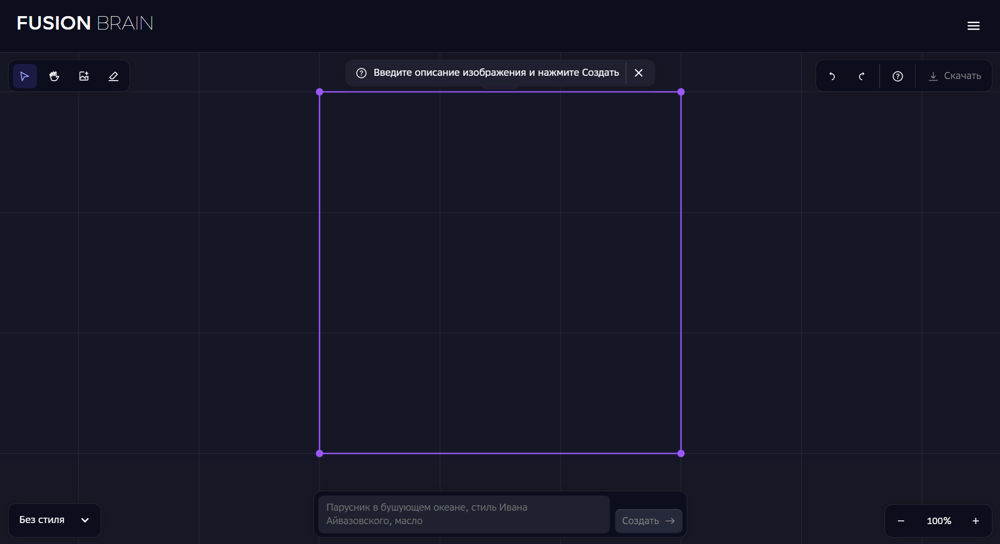

## Sber Kandinsky

Для начала работы с сервисом достаточно зайти на [сайт](https://www.sberbank.com/promo/kandinsky/) и нажать кнопку *начать творить*.  Затем перед вами откроется рабочее пространство, которое выглядит следующим образом:

В левом верхнем углу расположена панель инструментов позволяющая двигать рабочую рамку, перемещать, загружать и стирать изображение. В правом верхнем углу интерфейс отмены действий и возможности скачивания итоговой картинки. Слева снизу инструмент изменения стиля итогового изображения.

Снижу по центру расположена строка для ввода текста, приведен пример генерации.

Пример результатов по одному и тому же запросу.

Рещультат работы ластика:

Стертую часть изображения возможно дозаполнить новыми деталями:

И еще один небольшой пример с изменением позы персонажа:

