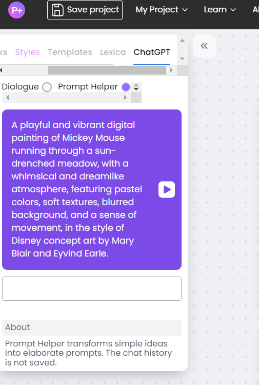

# Phygital+

Перед началом пользования необходимо пройти простую регистрацию на [сайте](https://phygital.plus/) и получить доступ к бесплатной версии.  После чего будет открыто главное окно сайта, где и будет создаватся проект.

По левой стороне экрана находится панель инструменов, чтобы воспользоваться ими достаточно просто перетянуть мышкой в белое рабочее пространство.

## Создание артбука

1. Загрузка ранее сгенерированного персонажа*

2. Удаление/изменение фона для персонажа по желанию

3. Персонажа с разных сторон

4. С помощью Inpaint на картинке можем рисовать маску. Нажав Mask+SD появиться новые node, прописываем запрос и получаем 4 варианта поз персонажа.

***
Более легкий вариант создание артбука. Описание артбука + референс 

 ## Создание расскадровки
 
 1. Создание Prompt запрос можно с помощью дополнительной функции
 
 
 2. Создаем с помощью Kadinsky по описанию сцену. Далее выбираем понравившуюся и делаем маску на персонажа. В prompt мы закидываем текстовое описание нашего героя. 
 И получаем раскадровку.
  

