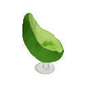
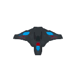
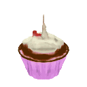

## Запуск генерации изображений

После выполнения инструкции по устанвке и запуску из [приложения](https://github.com/keoni02032/MouseHub/blob/main/application.md). Код запускается следующим образом:

```python
python3 start.py
```

Внутри файла strt.sh на строке 22 в ковычках сформулирован запрос к нейронной сети, который можно изменить на свой. Также на 19 строке после занка равно стоит цифра, она означает количество моделей кторое сгенерирует сеть в итоге, на 20 строке есть возможность поменять размер полаемых на выходе моделей.

После окончания выполнения программы реузультат сохраняется в папку *save_images*, если папка не создана самостоятельно, то программа создаст ее за вас.

## Примеры сгенерированных моделек.

На первом примере ниже приведена модель сгенерированная по нашему текстовому запросу. Остальные объекты являются примерами возможной генерации модели.


<table>
    <tbody>
        <tr>
            <td align="center">
                
            </td>
            <td align="center">
                
            </td align="center">
            <td align="center">
                
            </td>
        </tr>
        <tr>
            <td align="center">A chair that looks<br>like an avocado</td>
            <td align="center">An airplane that looks<br>like a banana</td>
            <td align="center">A spaceship</td>
        </tr>
        <tr>
            <td align="center">
                
            </td>
            <td align="center">
                
            </td>
            <td align="center">
                
            </td>
        </tr>
        <tr>
            <td align="center">A birthday cupcake</td>
            <td align="center">A chair that looks<br>like a tree</td>
            <td align="center">A green boot</td>
        </tr>
        <tr>
            <td align="center">
                
            </td>
            <td align="center">
                
            </td>
            <td align="center">
                
            </td>
        </tr>
        <tr>
            <td align="center">A penguin</td>
            <td align="center">Ube ice cream cone</td>
            <td align="center">A bowl of vegetables</td>
        </tr>
    </tbody>
<table>
